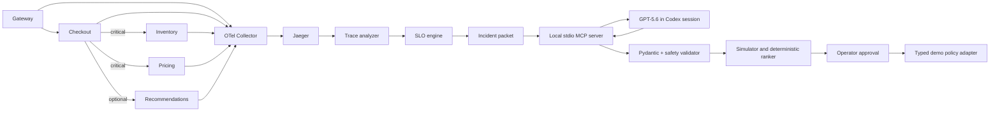

# SLO Guardian architecture

SLO Guardian separates probabilistic diagnosis from deterministic safety and enforcement.

## Architecture decision record

### ADR-001: Python throughout the MVP

Python 3.12, FastAPI, Pydantic v2, SQLAlchemy, OpenTelemetry, and pytest form one
schema-safe backend. Trace and simulator interfaces remain replaceable if later profiling justifies Go.

### ADR-002: Recommendations are an optional checkout branch

Inventory and pricing inherit critical traffic. Recommendations are explicitly optional and may
fall back without failing checkout.

### ADR-003: Model output is untrusted data

GPT receives an immutable incident packet and returns a strict schema. Evidence and policies are
validated locally. Simulation, approval, and activation accept only stored validated policy IDs.

### ADR-004: GPT-5.6 runs in Codex through local MCP

The application contains no OpenAI SDK, model endpoint, or API key. A trusted repo-scoped Codex
configuration selects `gpt-5.6-sol` with medium reasoning and starts a localhost-only stdio MCP
server. The signed-in Codex session reads incident packets and submits strict recommendations.

The MCP server exposes preparation, reading, submission, counterfactual simulation, and ranking.
It deliberately exposes no approval, activation, deactivation, arbitrary HTTP, or shell tool.
Recorded scenario-specific recommendations preserve a deterministic Docker-only demo.

### ADR-005: SQLite is sufficient for a local hackathon demo

SQLite persists incidents, candidates, simulations, approvals, and audit events while avoiding a
database service. Production persistence and distributed workers are deferred.

### ADR-006: Enforcement is synthetic and expires

Only allowlisted typed actions can reach internal service adapters. Active demo policies expire
after 30–600 seconds and never target an arbitrary host or production system.

## Safety invariants

1. Critical traffic is never shed or rate limited.
2. Model confidence never authorizes activation.
3. All cited evidence IDs must exist in the supplied packet.
4. Model impact estimates are display-only; simulator measurements are authoritative.
5. Internal policy endpoints require an environment-provided token.
6. The MCP server accepts only a fixed localhost control-plane URL and cannot activate policies.
